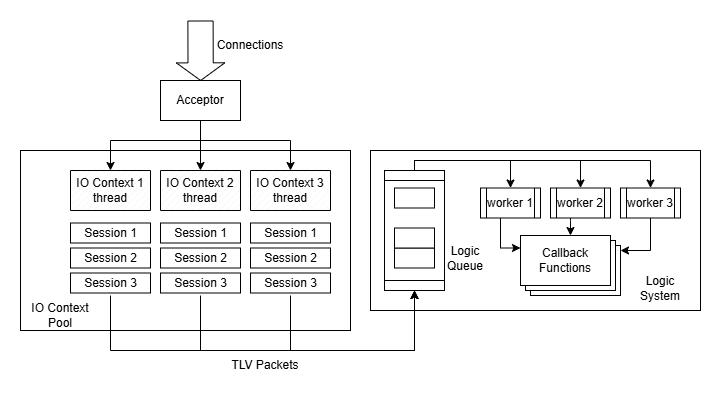

# CimpleServer
This is a simple but high performance framework of a TCP C++ server. Only need some callback functions, you can setup a simple server very quickly.

## Quick Start
You need to set port when initialize the server, and set callback functions map before the server get started.
When a new packet arrives the server, logic system will call the corresponding callback function according to its tag.

`LogicSystem::CallbackFunction` accepted 3 parameters
1. `std::shared_ptr<Session> session`
    It contains the information of the client and the session.
    You can get them by these functions:
    - `getUUID()` get the UUID of the session.
    - `getRemoteEndpoint()` get the client endpoint of the session.
    - `toString()` get formatted string looks like "address:port [UUID]".
2. `uint16_t tag`
    It is the tag of the message. It should follow the protocol between server and client.
3. `std::string_view message`
    The message content.

A simple echo server example.
``` cpp
void echo(std::shared_ptr<Session> session, uint16_t tag, std::string_view message) {
    std::cout << "Receive: \"" << message << "\" from " << session->getRemoteEndpoint() << std::endl;
    std::optional<boost::system::system_error> result = session->send(TLVPacket(tag, message));
    if (result.has_value()) {
        std::cout << "Echo failed to " << session->getRemoteEndpoint() << std::endl;
    }
}

int main() {
    Server server(10086);
    std::unordered_map<uint16_t, LogicSystem::CallbackFunction> callbacks;
    callbacks.insert({0, echo});
    LogicSystem::setCallbacks(callbacks);
    server.start();
    return 0;
}
```

## Packet
This framework uses TLV (Tag-Lenth-Value) format packet.

|   Tag   | Length  |     Value      |
|:-------:|:-------:|:--------------:|
| 2 Bytes | 2 Bytes | Max 4096 Bytes |

The `tag` of the packet will determine the callback function to be called in the server, via the hash map.

## Features
- High-performance network I/O
- Decoupled logic layer and network I/O
- Supporting multi-threaded logic processing (only one thread by default, you can changed it by passing the `ServerSetting` parameter when initialize the `Server`)
- Dynamic update callback functions (This will pause the logic processing temporally, please pay attention)

## Setup Setting
You can change the setting of server via `ServerSetting`
``` cpp
struct ServerSetting {
    int backlog = boost::asio::socket_base::max_listen_connections;
    int ioContextPoolSize = std::thread::hardware_concurrency();
    int logicQueueCapacity = 1024;
    int logicWorkerNum = 1;
    std::function<void()> stopCallback;
    ServerSetting() = default;
};
// Then set up the server like:
ServerSetting s;
s.logicWorkerNum = 114514;
Server server(10086. s);
```

## How to build client
In the this framework, we provide a simple Client class to build a simple client. You can check the example's for reference.

However, all the network IO are synchronous, you can build customized client by any method you like, as long as you follow the TLV format packet we mentioned [before](#packet).

## Examples
- [Echo server and client](./example/echo)
- [Hello server and client](./example/hello)
- [Server stress testing and example of multi-threaded logic processing server](./example/many-greeting)

## Server Structure
A new connection will be distributed to a random IO context thread in the context pool. Then a session will be created to receive the packets. After receiving a whole packet, the session will deliver a new logic node to the queue in the logic system. In the logic system, there are one or several worker thread(s) handling the node in the queue by call the callback functions corresponding to the packet tag.



## Dependency
- `Boost.Asio` (Boost Software License 1.0)
- `spdlog` (MIT License)
